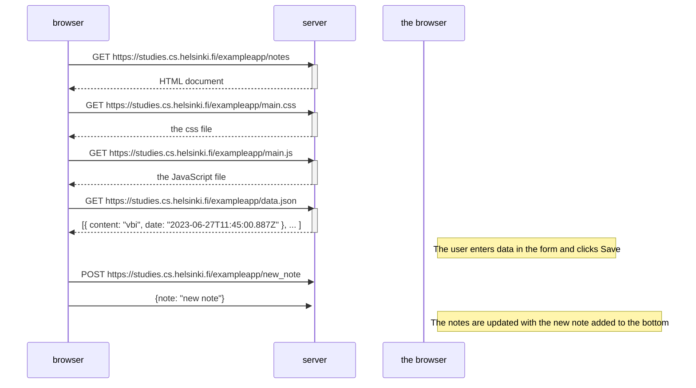

```mermaid
sequenceDiagram
    participant browser
    participant server

    browser->>server: GET https://studies.cs.helsinki.fi/exampleapp/notes
    activate server
    server-->>browser: HTML document
    deactivate server

    browser->>server: GET https://studies.cs.helsinki.fi/exampleapp/main.css
    activate server
    server-->>browser: the css file
    deactivate server

    browser->>server: GET https://studies.cs.helsinki.fi/exampleapp/main.js
    activate server
    server-->>browser: the JavaScript file
    deactivate server

    browser->>server: GET https://studies.cs.helsinki.fi/exampleapp/data.json
    activate server
    server-->>browser: [{ content: "vbi", date: "2023-06-27T11:45:00.887Z" }, ... ]
    deactivate server

    Note right of the browser: The user enters data in the form and clicks Save

    browser->>server: POST https://studies.cs.helsinki.fi/exampleapp/new_note
    activate server
    browser->>server: {note: "new note"}

    Note right of the browser: The notes are updated with the new note added to the bottom
```